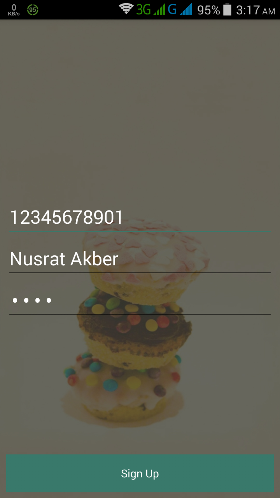
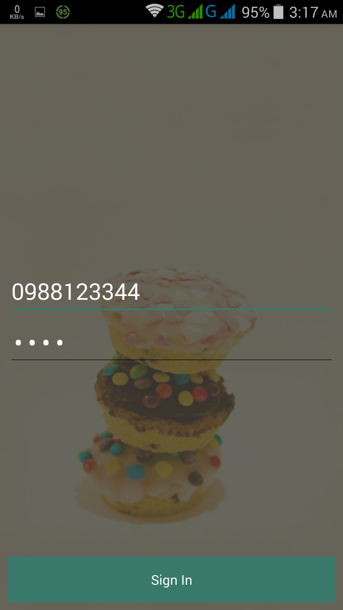
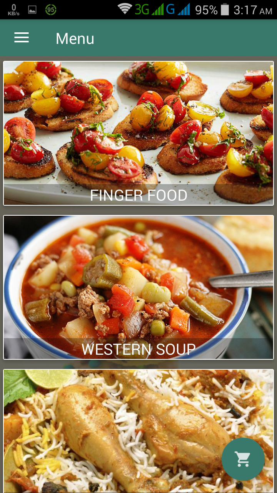
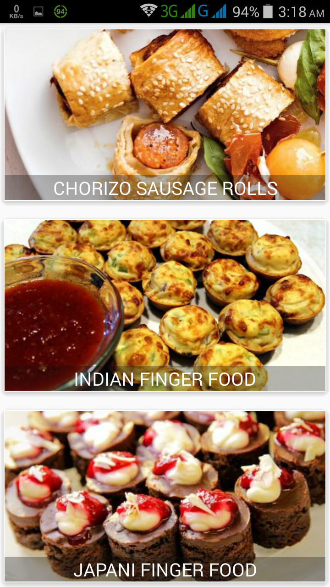
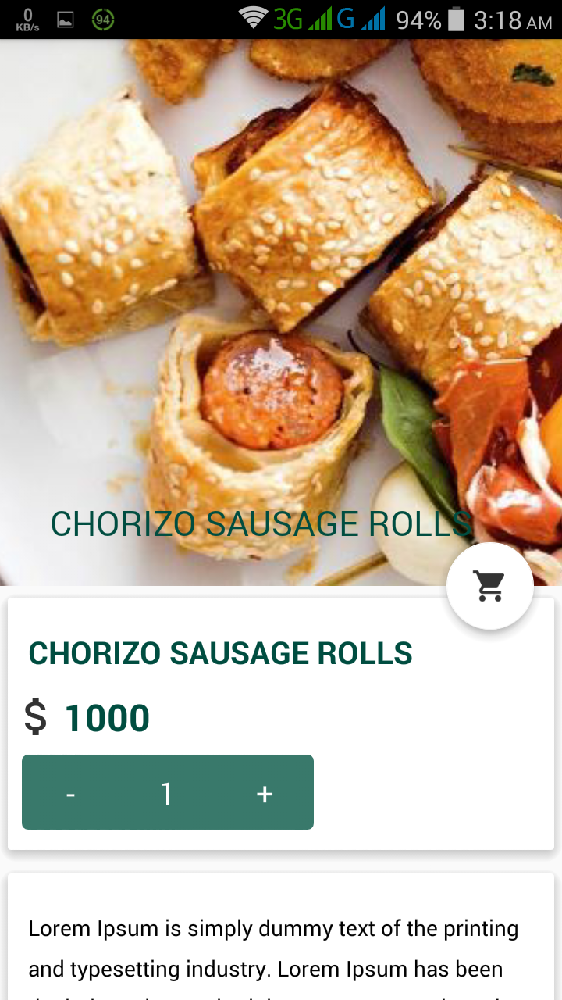
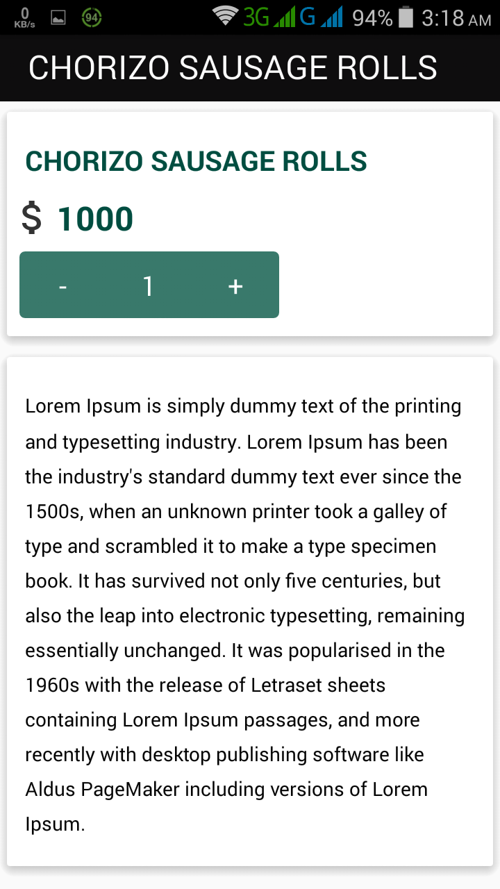
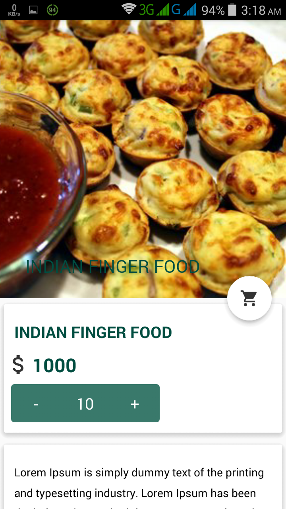
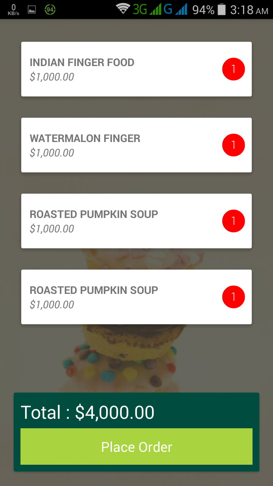
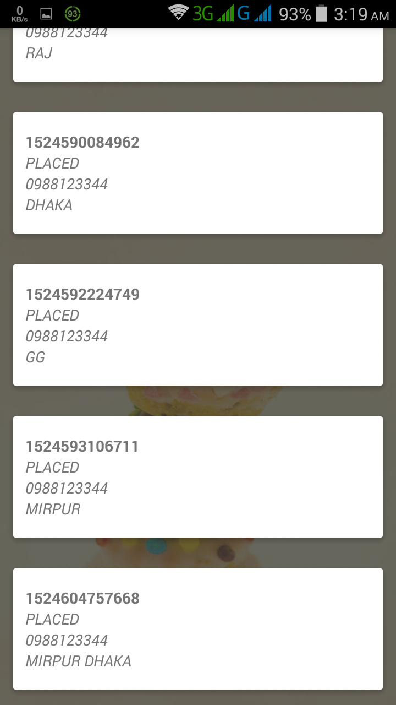
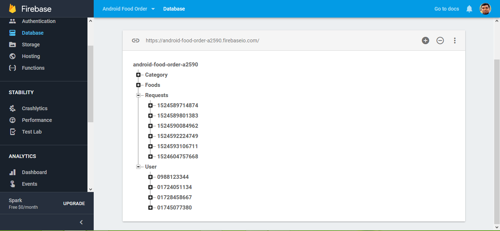

<h1>Name : Food Order App</ha>

<h3>Development Tools &Technologies</h3>
<ul>
  <li>Java</li>
  <li>XML</li>
  <li>Firebase</li>
  <li>Google Location Service</li>
  <li>Google Places</li>
</ul>

<h3>Main Features</h3>
<ul>
  <ol>Registration and Login option</ol>
  <ol>Remember Login Option</ol>
  <ol>Provide security code if user forget password</ol>
  <ol>Food Menu for different type of food</ol>
  <ol>Different type of food item under food menu</ol>
  <ol>Details about food item</ol>
  <ol>Order food and place order</ol>
  <ol>User can see order</ol>
</ul

<h3>Database</h3>
<ul>
  <li>SQLite</li>
  <li>Firebase</li>
</ul>

<h3>Using IDE for project development</h3>
 Android Studio 3.1

<h3>Using Library</h3>
 <ol>
  <li>FButton : For responsiv Button design</li>
  <li>MaterialEditText : For responsiv EditText design</li>
  <li>Picasso : Powerful image downloading and caching library for Android</li>
  <li>Elegant Number Button : Implement a number counter with increment and decrement buttons. </li>
  <li>Android SQLiteAssetHelper : An Android helper class to manage database creation and version management using an application's raw asset files.</li>
  <li>TextDrawable : This light-weight library provides images with letter/text like the Gmail app.</li>
</ol>

<h3>Project Features</h3>
<ol>
  <li>User Registration and SignIn</li>
  <li>Firebase Authentication</li>
  <li>Different types of food menu</li>
  <li>Different types of food under a menu item</li>
  <li>Details about food and add to Cart option</li>
  <li>Give Order for food</li>
  <li>Place order in SQLite and after that submit in Firebase</li>
  <li>Display order details</li>
</ol>

<h2>User registration, SignUp and SignIn</h2>

    
    
    

<h2>Menu, Food under menu and Food details with cart</h2>

    
    
    

<h2>Food details, CollapsToolBar, Food Add to Cart</h2>

    
    
    

<h2>Order Ready for Place, Place Order and Display Orders</h2>

    
    
    

<h2>All Information Store in Database</h2>

    

